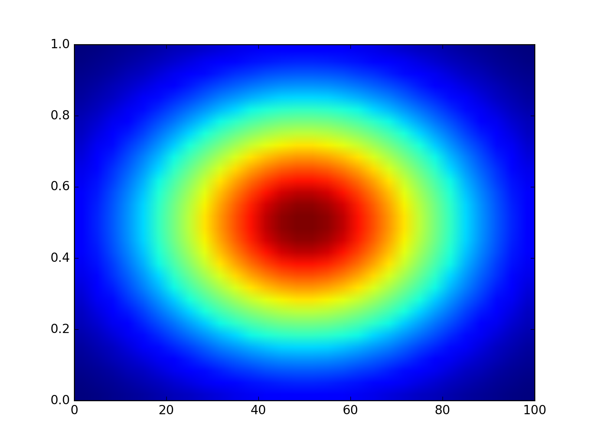

# rinobot-heatmap

Makes a simple heatmap of a grid of data.

## Installation

Just download the zip of the package and unzip into your `rinobot-packages` folder.

> [Download rinobot-heatmap.zip](https://github.com/rinocloud/rinobot-heatmap/archive/master.zip)

- On Windows your `rinobot-packages` folder is in `My Documents`.
- On Mac your `rinobot-packages` folder is in `Documents`.

## Example

If your data looks like

```
0.0 8.7 4.5 6.4 7.7 ...
1.4 2.4 3.4 5.6 7.6 ...
2.4 2.3 2.2 4.6 2.2 ...
3.3 3.5 7.3 1.7 6.3 ...
4.1 7.3 5.6 6.7 9.8 ...
...
...
```

If will generate a graph like


